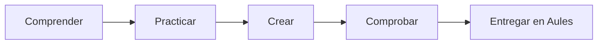

# B01 · Entorno digital, nube y ciudadanía

4 semanas · 8 sesiones aproximadas

## La misión

¿Cómo organizamos y compartimos nuestro trabajo sin perder el control de los datos?

[Aprender](aprende.md){ .md-button .md-button--primary }
[Actividades](actividades.md){ .md-button }
[Proyecto](proyecto.md){ .md-button }
[Entrega](entrega.md){ .md-button }

## Producto de la unidad

**Mochila digital y protocolo personal de ciudadanía.**

## Ruta

