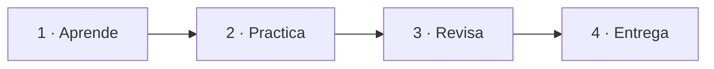

# B01 · Tu entorno digital

## La misión

Vas a construir una **mochila digital** ordenada, segura y preparada para todo el curso. Aprenderás a encontrar tus archivos, trabajar en la nube, compartir con el permiso correcto y comportarte responsablemente en Internet.

[Comenzar a aprender](aprende.md){ .md-button .md-button--primary }
[Ver la práctica](practica.md){ .md-button }

## Al terminar podrás…

- organizar archivos y carpetas con nombres útiles;
- distinguir almacenamiento local, en red y en la nube;
- compartir utilizando el permiso mínimo necesario;
- reconocer una fuente digital fiable;
- proteger tu identidad y tu huella digital;
- comunicarte con netiqueta y respetar la autoría.

## Ruta del bloque

!!! question "Pregunta guía"
    ¿Podría otra persona encontrar, comprender y proteger tu trabajo digital sin que estuvieras delante para explicárselo?

