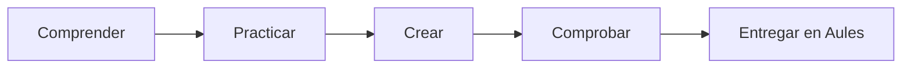

# B03 · Redes, ciberseguridad y privacidad

5 semanas · 10 sesiones aproximadas

## La misión

¿Cómo viaja la información y qué decisiones reducen los riesgos?

[Aprender](aprende.md){ .md-button .md-button--primary }
[Actividades](actividades.md){ .md-button }
[Proyecto](proyecto.md){ .md-button }
[Entrega](entrega.md){ .md-button }

## Producto de la unidad

**Plan de red segura y campaña contra el phishing.**

## Ruta

