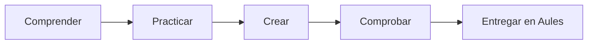

# B05 · Creación multimedia

5 semanas · 10 sesiones aproximadas

## La misión

¿Cómo comunicamos una idea con imagen, sonido y vídeo respetando a las personas?

[Aprender](aprende.md){ .md-button .md-button--primary }
[Actividades](actividades.md){ .md-button }
[Proyecto](proyecto.md){ .md-button }
[Entrega](entrega.md){ .md-button }

## Producto de la unidad

**Pieza audiovisual accesible de 60–90 segundos.**

## Ruta

