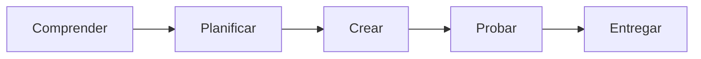

# Imagen, audio y vídeo

3.º ESO

## La misión

Crear una campaña multimedia breve que informe con claridad, respete las licencias y sea accesible.

[Comenzar a aprender](aprende.md){ .md-button .md-button--primary }
[Ver la práctica](practica.md){ .md-button }

## Al terminar podrás…

- explicar los conceptos esenciales del bloque con vocabulario preciso;
- aplicar un procedimiento ordenado para resolver el reto;
- crear un producto digital funcional y comprensible;
- comprobar seguridad, privacidad, accesibilidad y autoría;
- revisar el resultado a partir de evidencias.

## Ruta de trabajo

!!! question "Pregunta guía"
    ¿Qué hace que un contenido digital sea atractivo sin dejar de ser comprensible y responsable?

