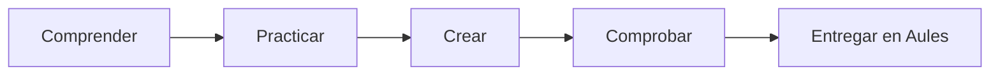

# B06 · Programación y web

6 semanas · 12 sesiones aproximadas

## La misión

¿Cómo transformamos un problema en instrucciones y en una publicación web comprobable?

[Aprender](aprende.md){ .md-button .md-button--primary }
[Actividades](actividades.md){ .md-button }
[Proyecto](proyecto.md){ .md-button }
[Entrega](entrega.md){ .md-button }

## Producto de la unidad

**Programa por bloques y micrositio accesible.**

## Ruta

