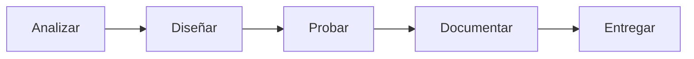

# B01 · Colaboración digital segura

## La misión

Diseñarás un sistema digital para un equipo que debe trabajar durante un trimestre. El sistema tendrá que evitar pérdidas, duplicados, permisos excesivos y conflictos entre versiones.

[Comenzar a aprender](aprende.md){ .md-button .md-button--primary }
[Ver la práctica](practica.md){ .md-button }

## Al terminar podrás…

- diseñar una estructura documental mantenible;
- establecer una convención de nombres y versiones;
- aplicar el principio de mínimo privilegio;
- prevenir y resolver conflictos de edición;
- evaluar fuentes mediante criterios explícitos;
- redactar normas de colaboración y ciudadanía digital.

## Ruta del bloque

!!! question "Pregunta guía"
    ¿Seguiría funcionando vuestro sistema si mañana se incorporara una persona que no ha escuchado ninguna explicación?

