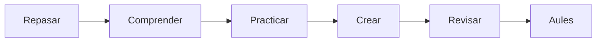

# UD02 · Canva y comunicación visual

4 semanas · 8 sesiones aproximadas

## Pregunta guía

¿Cómo podemos aplicar canva y comunicación visual para crear un producto útil, seguro y comprobable?

## Producto

**Campaña visual con identidad coherente**

[Explicaciones](aprende.md){ .md-button .md-button--primary }
[Actividades](actividades.md){ .md-button }
[Proyecto](proyecto.md){ .md-button }
[Entrega en Aules](entrega.md){ .md-button }

## Ruta

