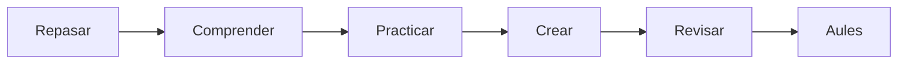

# UD06 · Introducción a Python

6 semanas · 12 sesiones aproximadas

## Pregunta guía

¿Cómo podemos aplicar introducción a python para crear un producto útil, seguro y comprobable?

## Producto

**Juego o miniaplicación de texto**

[Explicaciones](aprende.md){ .md-button .md-button--primary }
[Actividades](actividades.md){ .md-button }
[Proyecto](proyecto.md){ .md-button }
[Entrega en Aules](entrega.md){ .md-button }

## Ruta

